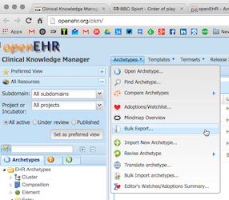
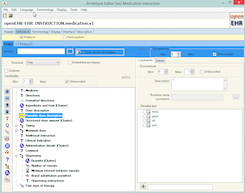
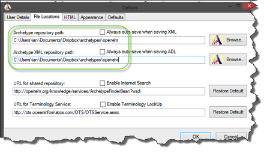
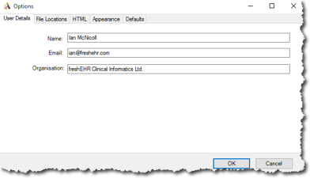
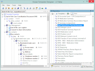
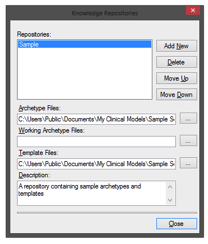
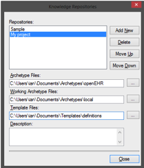

# openEHR Clinical modelling tools setup

These instructions will guide you through the process of setting up your computer with a set of openEHR clinical models (archetypes and templates), and a number of tools that will let you create new models or modify existing models.
 
## A. Setup appropriate Folders on your computer

* Create a new folder in a location of your choice called ``openehr_training``.  e.g. ``..\Documents\openehr_training`` 
 
* Add a new folder named ``local`` under ``openehr_training``. e.g.  ``..\Documents\openehr_training\local`` . This will hold archetypes and templates that we create ourselves.  

	* Add a new folder named ``archetypes`` under ``local``. e.g.  ``..\Documents\openehr_training\local\archetypes``
	* Add a new folder named ``templates`` under ``local``. e.g.  ``..\Documents\openehr_training\local\templates``    

* Add a new folder named ``remote`` under ``openehr_training``. e.g.  ``..\Documents\openehr_training\remote``. This will hold archetypes and templates that we download from other places.  
	* Add a new folder named ``ckm`` under ``remote``. e.g.  ``..\Documents\openehr_training\remote\ckm``  
  
You should now have a folder structure something like …

* openehr_training
	* local
		* archetypes
		* templates
	* remote
		* ckm
	
 

## B. Download Archetypes from the openEHR Foundation Clinical Knowledge Manager

The openEHR Foundation Clinical Knowledge Manager (CKM) is a web-based tool that stores openEHR clinical models that are developed collaboratively by the openEHR community and made freely available for others to use and copy.

Go to [openEHR Foundation CKM](http://openehr.org/ckm) then from the top menu select ``Archetypes->Bulk Export``. 
 

This will create a zip file with the latest versions of openEHR Foundation CKM archetypes.

Download this zip file and unzip it into the remote/ckm folder you created earlier e.g. ``..\Documents\openehr_training\models\remote\ckm`` making sure you preserve the folders.

You should now have something like

* openehr_training
	* local
		* archetypes
		* templates
	* remote
		* ckm
			* local
				* archetypes
				* templates
			* remote
				* archetypes
				* templates
	
Depending on how your zip program works you may need to move the unzipped folders around to match this pattern.

### CKM ‘GitHub mirror’
 
Git is a common software version control tool. The CKM archetypes and templates are ‘mirrored’ out to a Git repository hosted at the [openEHR Github](https://github.com/openEHR/CKM-mirror).


If you are familiar with using Git, you can clone the repository as  ``git clone https://github.com/openEHR/CKM-mirror.git``.

## C. Install the XMIND freeware Mindmap tool

As clinical modellers we make extensive use of mind map tools and find that the free XMIND tool is one of the best. It works on Windows, Linux and MacOSX.

  

You should download XMIND from [XMIND installer](http://xmind.net/downloads/).


## D. Install the openEHR Archetype Editor

The Archetype Editor is the tool we use to create and adapt archetypes.



Download the Archetype Editor from [openEHR Archetype Editor Download page](http://www.openehr.org/downloads/archetypeeditor/home)

This installs the openEHR Archetype Editor (ArchetypeEditor.exe) in the folder …

``C:\Program Files\openEHR\Archetype Editor`` on Windows-32 systems
``C:\Program Files(x86)\openEHR\Archetype Editor`` on Windows-64 systems

and should set up links on your Desktop or Start Menu etc.

### Setup the openEHR Archetype Editor 

Run the Archetype Editor from the Desktop or Start Menu.

At the initial screen, open any existing archetype on your system e.g. one of the CKM archetypes previously downloaded

``..\Documents\openehr_training\remote\ckm\archetypes\cluster\OPENEHR-EHR-CLUSTER.device.v1.adl``

Or one of the sample archetypes provided at

..\Users\Public\Documents\My Clinical Models\Sample Set\Archetypes

#### Set the default Archetype Editor paths

     Go to ``Tools->Options->File Locations`` and set both

          **Archetype Repository path**  
          and  
          **Archetype XML Repository path**  

      to    ``..\Documents\openehr_training``  


#### Setup User Defaults

Go to ``Tools->Options->User Defaults``

and enter your details e.g.

```
Name: Ian McNicoll

Email: [ian@freshehr.com]
Organisation: freshEHR Clinical Informatics, UK
```
  

##  D. Ocean Template Designer

The Ocean Template Designer is a free download available at …

[Ocean Template Designer Latest Beta Release](http://www.openehr.org/download_files/TemplateDesigner/TemplateDesignerSetup_2.8.94.2.exe)

Once installed you can run the Template Designer from the Desktop or Start Menu.  



### Template Designer path setup

Go to ``Tools->Knowledge repository->Edit Repository List``

1. Add a new Repository e.g. ``openEHR Training``  


2. Complete these paths…

  **Archetype Files**

 ``..\Documents\Archetypes\openehr_training\remote``

 **Working Archetype Files**

 ``..\Documents\openehr_training\local\archetypes``

 **Template Files**

 ``..\Documents\openehr_training`` 



## F. openEHR Archetype Workbench Install

The Archetype Workbench is a technical tool used for experimentation and testing.  

The latest version is available at
[openEHR Archetype Workbench](http://www.openehr.org/downloads/ADLworkbench/home)


## G. CKM resources

[openEHR CKM](http://www.openehr.org/ckm/): Models maintained by the international openEHR community.

[NEHTA CKM](http://dcm.nehta.org.au/ckm/): Models maintained by NEHTA for the Australian national eHealth program.

[UK CKM](http://clinicalmodels.org.uk/ckm): Models maintained by a consortium of UK health organisations.

[Norwegian CKM](http://arketyper.no/ckm/): Models maintained by the Norwegian national eHealth program.

[Slovenian CKM](http://ukz.ezdrav.si/ckm/OKM.html): Models maintained by the Slovenian national eHealth program.

## H. Tools Internationalisation

The Archetype Editor and Template Designer can be setup to use non-English languages.

[Instructions on setting language and other internationalisation options](https://github.com/freshehr/openehr_tool_docs/blob/master/tools_internationalisation.md)


